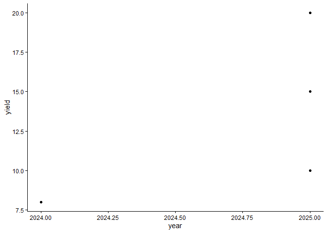
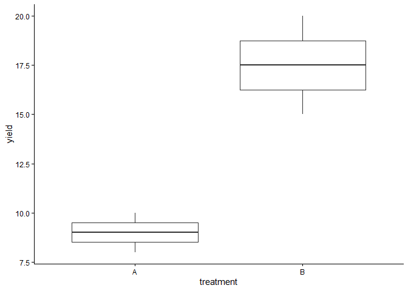

# 1. Recap Material

Give me notes on the recap material. These questions focus on material
that students commonly struggle with (data wrangling, plotting,
modeling, or debugging).

\##Data Wrangling (dplyr)

Data wrangling is the process of preparing and transforming raw data
into a useful format. The `dplyr` package provides several important
functions:

-   `select()` is used to choose specific columns  
-   `filter()` extracts rows based on conditions  
-   `mutate()` creates or modifies variables  
-   `summarise()` calculates summary statistics  
-   `group_by()` groups the data before summarizing

It is important to always check column names and ensure variables have
the correct data types before performing operations.

Example

    library(dplyr)

    ## 
    ## Attaching package: 'dplyr'

    ## The following objects are masked from 'package:stats':
    ## 
    ##     filter, lag

    ## The following objects are masked from 'package:base':
    ## 
    ##     intersect, setdiff, setequal, union

    # Create example dataset
    df <- data.frame(
      year = c(2025, 2025, 2024, 2025),
      treatment = c("A", "B", "A", "B"),
      yield = c(10, 15, 8, 20),
      rep1 = c(5,6,4,7),
      rep2 = c(7,5,6,8)
    )

    # Perform filtering, grouping, and summarizing
    data_summary <- df %>%
      filter(year == 2025) %>%
      group_by(treatment) %>%
      summarise(mean_yield = mean(yield, na.rm = TRUE))

    # Show results
    data_summary

    ## # A tibble: 2 × 2
    ##   treatment mean_yield
    ##   <chr>          <dbl>
    ## 1 A               10  
    ## 2 B               17.5

Common Mistakes Using summarise() without grouping first Incorrect or
misspelled column names Treating categorical variables as numeric

\##Plotting (ggplot2) The ggplot2 package is used to create
visualizations. A basic plot structure looks like this:

    library(ggplot2)

    ## Warning: package 'ggplot2' was built under R version 4.5.2

    # Scatter plot with real columns
    ggplot(df, aes(x = year, y = yield)) +
      geom_point() +
      theme_classic()

Common layers include: geom\_point() for scatterplots geom\_line() for
line graphs geom\_bar(stat = “identity”) for bar charts facet\_wrap()
for multiple panels theme\_classic() for a simple design

Example

    ggplot(df, aes(x = treatment, y = yield)) +
      geom_boxplot() +
      theme_classic()

Common Mistakes Incorrect placement of variables inside/outside aes()
Forgetting to use + between layers Using wrong variable names Plotting
unsummarized data incorrectly

\##Linear Modeling Linear models are used to study relationships between
variables.

Examples

    model <- lm(yield ~ treatment, data = df)
    summary(model)

    ## 
    ## Call:
    ## lm(formula = yield ~ treatment, data = df)
    ## 
    ## Residuals:
    ##    1    2    3    4 
    ##  1.0 -2.5 -1.0  2.5 
    ## 
    ## Coefficients:
    ##             Estimate Std. Error t value Pr(>|t|)  
    ## (Intercept)    9.000      1.904   4.727   0.0420 *
    ## treatmentB     8.500      2.693   3.157   0.0874 .
    ## ---
    ## Signif. codes:  0 '***' 0.001 '**' 0.01 '*' 0.05 '.' 0.1 ' ' 1
    ## 
    ## Residual standard error: 2.693 on 2 degrees of freedom
    ## Multiple R-squared:  0.8329, Adjusted R-squared:  0.7493 
    ## F-statistic: 9.966 on 1 and 2 DF,  p-value: 0.08739

Important Outputs Estimate: shows the effect size p-value: indicates
statistical significance R-squared: measures model fit Residuals: show
prediction errors

Prediction

    predict(model)

    ##    1    2    3    4 
    ##  9.0 17.5  9.0 17.5

Common Mistakes Mixing up predictor and response variables Not
converting categorical variables into factors Ignoring missing values in
the dataset

\##Debugging Debugging helps identify and fix errors in code. Useful
strategies include: Carefully reading error messages Running code
step-by-step Checking object and variable names Verifying parentheses
and commas Inspecting data using str() and names()

Example

    str(df)

    ## 'data.frame':    4 obs. of  5 variables:
    ##  $ year     : num  2025 2025 2024 2025
    ##  $ treatment: chr  "A" "B" "A" "B"
    ##  $ yield    : num  10 15 8 20
    ##  $ rep1     : num  5 6 4 7
    ##  $ rep2     : num  7 5 6 8

    names(df)

    ## [1] "year"      "treatment" "yield"     "rep1"      "rep2"

\#2. Extra Topic Exploration

Complete one of the extra optional materials provided, OR explore a
topic of your choice, or find a topic online and explore the code and
how it works.

I explored the pivot\_longer() function from the tidyr package, which is
used to reshape data from wide format into long format. This is
especially useful when preparing data for visualization and analysis.

Example

    library(tidyr)

    ## Warning: package 'tidyr' was built under R version 4.5.2

    long_df <- df %>%
      pivot_longer(
        cols = starts_with("rep"),
        names_to = "replicate",
        values_to = "value")

    long_df

    ## # A tibble: 8 × 5
    ##    year treatment yield replicate value
    ##   <dbl> <chr>     <dbl> <chr>     <dbl>
    ## 1  2025 A            10 rep1          5
    ## 2  2025 A            10 rep2          7
    ## 3  2025 B            15 rep1          6
    ## 4  2025 B            15 rep2          5
    ## 5  2024 A             8 rep1          4
    ## 6  2024 A             8 rep2          6
    ## 7  2025 B            20 rep1          7
    ## 8  2025 B            20 rep2          8

Why It Is Useful Makes plotting easier Simplifies grouping and
summarizing Helps maintain a tidy data structure

Justification I chose this topic because reshaping data is an important
step in many analyses. I wanted to better understand how to organize
datasets in a way that works efficiently with visualization and modeling
tools. This will help me work with more complex datasets in the future.

# 3. Introduction to renv

Follow the coding demonstration in class. Turn in notes.

## renv Notes

**Purpose:** - Creates reproducible R environments  
- Keeps track of package versions  
- Helps others run the same code without issues

## Initialize Project

    install.packages("renv")

    ## The following package(s) will be installed:
    ## - renv [1.2.0]
    ## These packages will be installed into "C:/Users/admin/Desktop/Assignments-repository/renv/library/windows/R-4.5/x86_64-w64-mingw32".
    ## 
    ## # Installing packages --------------------------------------------------------
    ## ✔ renv 1.2.0                               [linked from cache]
    ## Successfully installed 1 package in 30 milliseconds.

    renv::init()

    ## - The project is out-of-sync -- use `]8;;x-r-run:renv::status()renv::status()]8;;` for details.

Install Packages

    install.packages("dplyr")

    ## The following package(s) will be installed:
    ## - dplyr [1.2.1]
    ## These packages will be installed into "C:/Users/admin/Desktop/Assignments-repository/renv/library/windows/R-4.5/x86_64-w64-mingw32".
    ## 
    ## # Installing packages --------------------------------------------------------
    ## ✔ dplyr 1.2.1                              [linked from cache]
    ## Successfully installed 1 package in 14 milliseconds.

Save Environment

    renv::snapshot()

    ## The following required packages are not installed:
    ## - kable
    ## Packages must first be installed before renv can snapshot them.
    ## Use `]8;;x-r-run:renv::dependencies()renv::dependencies()]8;;` to see where this package is used in your project.
    ## 
    ## - The lockfile is already up to date.

Restore Environment

    renv::restore()

    ## - The library is already synchronized with the lockfile.

Files Created renv.lock → stores package version details renv/ folder →
contains the project library

Why It Is Important Ensures results can be reproduced Avoids conflicts
between package versions Makes it easier to share projects with others
